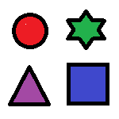

# CNN의 학습 과정에 대한 생각 정리 

"비전 시스템을 위한 딥러닝" 이라는 책에서 
CNN은 은닉층을 거쳐가며 학습이 진행되는데 
첫번째 은닉층은 직선이나 모서리와 같은 간단한 특징을 학습하며 뒤로 갈수록 이런 특징을 조합하여 도형, 꼭짓점, 원등의 특징을 인식한다.

은닉층이 뒤로 갈수록 사람의 이목구비와 같은 복잡한 형태를 학습한다 라는 내용이 있어 직접 시각화를 진행하며 이해를 해보고자 하였다.

## 이미지 선정 

처음에는 "강아지와 고양이" 이미지를 사용하여 진행을 해보고자 하였으나 조금 더 특징이 명확한 이미지로 진행해보고자 단순한 도형 이미지를 생성하고 진행해보았다.

