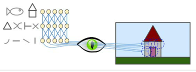

# 합성곱 신경망을 사용한 컴퓨터 비전 

## Intro

Intro

- CNN은 시각 피질 연구에서 시작되었음 
- 시각분야, 음성인식, 자연어처리에 사용됨
- 시각지능  
    1. CNN구조 
    2. Object Detection
    3. Semantic Segmentation

## 14.1 시각 피질 구조 

시각 피질 구조

- 고수준 뉴런이 저수준 뉴런의 출력에 기반한다는 아이디어

- 이미지의 부분 특성이 모여 전체를 인식하는 느낌

