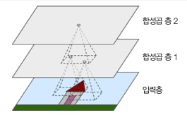
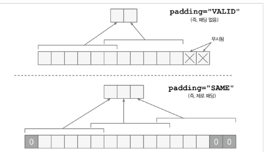

# 합성곱 신경망을 사용한 컴퓨터 비전 

## 14.2 합성곱 층 
<details>
<summary>합성곱 층</summary>

- 합성곱 층의 뉴런은 입력된 이미지의 모든 픽셀에 연결되는 것이 아님
- 필터의 영역 안에 있는 픽셀에만 연결됨
- 저수준 특성에 집중하고 고수준 특성으로 조합해 나갈수 있는 특징이됨



- 인식하는 과정에서 스트라이드, 패딩의 과정을 사용할 수 있음

</details>

### 14.2.1 필터 
<details>
<summary>필터</summary>

- 필터는 feature map 을 생성함
- FM은 가장 필터를 가장 크게 활성화시키는 이미지의 영역을 강조

</details>

### 14.2.2 여러가지 특성 맵 찾기 
<details>
<summary>여러가지 특성 맵 찾기</summary>

- feature map의 픽셀은 하나의 뉴런에 해당 
- 하나의 feature map에서는 모든 뉴런이 동일한 가중치와 편향을 공유
- 다른 feature map의 뉴런은 다른 파라미터를 사용
- 하나의 CNN층이 입력에 여러 필터를 적용하여 입력 이미지의 여러가지 특성을 감지할 수 있음  
(여러가지 필터를 사용하면 좋은 이유?)

(CNN층의 뉴런 출력 수학 계산 식은 생략)

</details>

### 14.2.3 텐서플로 구현 
<details>
<summary>텐서플로 구현</summary>

- 입력 이미지의 구성 [높이, 너비, 채널]
- 미니배치 이미지 구성 [갯수, 높이, 너비, 채널]

- SAME vs VALID Padding  



- CNN층 구성
```python
conv = keras.layers.Conv2D(filter=32, kernel_size=3, strides=1, padding="same", activation="relu")

# 위 식은 아래와 같이 사용 가능
conv = keras.layers.Conv2D(32,(3,3), padding="same", activation="relu")

# filter와 kernel_size를 축약하여 사용하며 strides의 경우 기본 값을 사용하면 기재하지 않음
```
</details>

### 14.2.4 메모리 요구 사항 

- RAM에 관련된 내용으로 정리 생략 