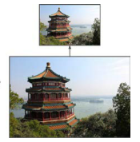
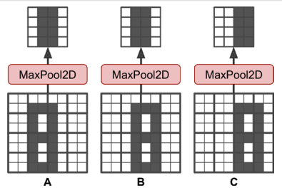

# 합성곱 신경망을 사용한 컴퓨터 비전 

## 14.3 풀링 층
<details>
<summary>풀링 층</summary>

- 풀링의 목적
    - 계산량, 메모리 사용량, 파라미터 수를 줄이기 위함
    - subsample (축소본)을 생성하기 위함

 


- 최대 풀링의 경우 작은 변화에도 일정 수준의 불변성을 생성
    - (추가) 이 부분에서 Pooling이 무조건 이득은 아닌 경우가 있는데, 작은 변화에도 민감해야 하는 사례들이 있는 경우임
        - ex)자율 주행 자동차의 경우 작은 변화에 매우 민감할 경우가 있음.

    - 회전, 확대, 축소에 대한 약간의 불변성을 제공

    

- 단점
    - Stride 2를 사용하여 축소를 진행해도 면적이 1/4로 줄어듬 (사실상 75% 손실)
    - 시맨틱 분할의 경우 불변성이 필요하지 않음
    - 등변성이 필요한 경우도 있음

</details>


### 14.3.1 텐서플로 구현 
<details>
<summary>텐서플로 구현</summary>


```python
pool = keras.layers.MaxPool2D(pool_size=2)
```

- 풀링의 경우 MaxPool2D, AvgPool2D 정도 존재
- 일반적으로 MaxPool이 성능이 좋은 편  

- 단, AvgPool의 경우 정보 손실이 적다는 이점이 있음
- 단, MaxPool의 경우 의미 없는 특징은 줄이고 가장 큰 특징만 유지 
- MaxPool의 경우 명확한 결과가 될 수 있으며 AvgPool보다 강력한 이동 불변성과 연산 비용이 조금 적음

- 깊이 방향 Pool에 대해서 나왔으나 keras는 제공하지 않아 내용 생략함

- Stochastic Pooling 
    - MaxPool과 AvgPool의 문제를 해결하기 위해 고안
    - 가장 강한 특성이 아니더라도 중요한 정보가 있는 경우 보존이 가능 

- Global Average Pooling Layer도 존재
    - 각 특성 맵의 평균을 계산
    - 특성 맵 하나가 하나의 숫자를 출력 
    - 특성 맵의 대부분의 정보를 잃으나, 유용한 경우도 있음
```python
global_avg_pool = keras.layers.GlobalAvgPool2D()
```

</details>