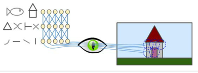
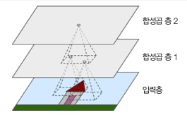
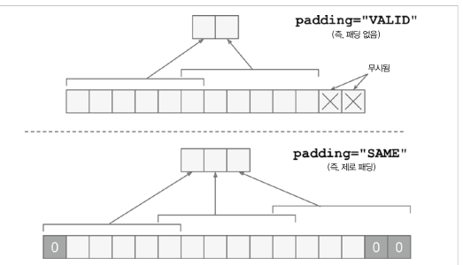
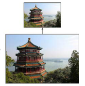
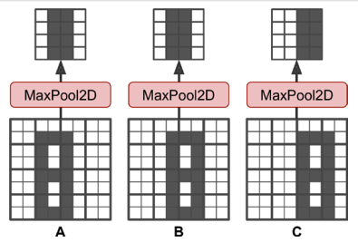
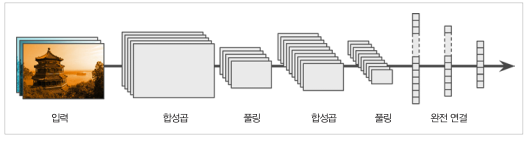

# 합성곱 신경망을 사용한 컴퓨터 비전 

## Intro

- CNN은 시각 피질 연구에서 시작되었음 
- 시각분야, 음성인식, 자연어처리에 사용됨
- 시각지능  
    1. CNN구조 
    2. Object Detection
    3. Semantic Segmentation


## 14.1 시각 피질 구조 

- 고수준 뉴런이 저수준 뉴런의 출력에 기반한다는 아이디어



- 이미지의 부분 특성이 모여 전체를 인식하는 느낌


## 14.2 합성곱 층 

- 합성곱 층의 뉴런은 입력된 이미지의 모든 픽셀에 연결되는 것이 아님
- 필터의 영역 안에 있는 픽셀에만 연결됨
- 저수준 특성에 집중하고 고수준 특성으로 조합해 나갈수 있는 특징이됨



- 인식하는 과정에서 스트라이드, 패딩의 과정을 사용할 수 있음


### 14.2.1 필터 

- 필터는 feature map 을 생성함
- FM은 가장 필터를 가장 크게 활성화시키는 이미지의 영역을 강조


### 14.2.2 여러가지 특성 맵 찾기 

- feature map의 픽셀은 하나의 뉴런에 해당 
- 하나의 feature map에서는 모든 뉴런이 동일한 가중치와 편향을 공유
- 다른 feature map의 뉴런은 다른 파라미터를 사용
- 하나의 CNN층이 입력에 여러 필터를 적용하여 입력 이미지의 여러가지 특성을 감지할 수 있음  
(여러가지 필터를 사용하면 좋은 이유?)

(CNN층의 뉴런 출력 수학 계산 식은 생략)


### 14.2.3 텐서플로 구현 

- 입력 이미지의 구성 [높이, 너비, 채널]
- 미니배치 이미지 구성 [갯수, 높이, 너비, 채널]

- SAME vs VALID Padding 


- CNN층 구성
```python
conv = keras.layers.Conv2D(filter=32, kernel_size=3, strides=1, padding="same", activation="relu")

# 위 식은 아래와 같이 사용 가능
conv = keras.layers.Conv2D(32,(3,3), padding="same", activation="relu")

# filter와 kernel_size를 축약하여 사용하며 strides의 경우 기본 값을 사용하면 기재하지 않음
```


### 14.2.4 메모리 요구 사항 

- RAM에 관련된 내용으로 정리 생략 


## 14.3 풀링 층
- 풀링의 목적
    - 계산량, 메모리 사용량, 파라미터 수를 줄이기 위함
    - subsample (축소본)을 생성하기 위함



- 최대 풀링의 경우 작은 변화에도 일정 수준의 불변성을 생성
    - 회전, 확대, 축소에 대한 약간의 불변성을 제공
    

- 단점
    - Stride 2를 사용하여 축소를 진행해도 면적이 1/4로 줄어듬 (사실상 75% 손실)
    - 시맨틱 분할의 경우 불변성이 필요하지 않음
    - 등변성이 필요한 경우도 있음

### 14.3.1 텐서플로 구현 
```python
pool = keras.layers.MaxPool2D(pool_size=2)
```

- 풀링의 경우 MaxPool2D, AvgPool2D 정도 존재
- 일반적으로 MaxPool이 성능이 좋은 편  

- 단, AvgPool의 경우 정보 손실이 적다는 이점이 있음
- 단, MaxPool의 경우 의미 없는 특징은 줄이고 가장 큰 특징만 유지 
- MaxPool의 경우 명확한 결과가 될 수 있으며 AvgPool보다 강력한 이동 불변성과 연산 비용이 조금 적음

- 깊이 방향 Pool에 대해서 나왔으나 keras는 제공하지 않아 내용 생략함

- Global Average Pooling Layer도 존재
    - 각 특성 맵의 평균을 계산
    - 특성 맵 하나가 하나의 숫자를 출력 
    - 특성 맵의 대부분의 정보를 잃으나, 유용한 경우도 있음
```python
global_avg_pool = keras.layers.GlobalAvgPool2D()
```


## 14.4 CNN 구조 

- 전형적인 CNN 구조 
    - CNN 층을 몇 개 쌓음(```activation="relu"```)
    - Pool 층을 몇 개 쌓음 
    - CNN 층을 몇 개 쌓음 (```activation="relu"```)
    - Pool 층을 몇 개 쌓음

- 층을 진행할수록 입력된 이미지의 크기는 점점 작이짐
- 점점 많은 특성 맵을 가지게 됨

- 맨 위층에는 Fully Connected Layer(```activation="relu"```)를 설정 

- 마지막 층에서 예측 계산(activation은 유형에 따라 다름)


- CNN 층에 필터를 크게 사용하지 않는 것이 좋다 
    - ex) 5x5 대신 3x3 2개를 사용하는 것이 이득
    - 5x5 : 25 + 1 개의 파라미터 
    - 3x3 : 9 + 1 개의 파라미터 
    - 3x3 2개 : 9 x 2 + 2 개의 파라미터 

- 간단한 MNist 분류 CNN 모델 작성 
```python
from functools import partial

DefaultConv2D = partial(keras.layers.Conv2D,
                        kernel_size=3, activation='relu', padding="SAME")

model = keras.models.Sequential([
    # 64개의 7x7 필터
    DefaultConv2D(filters=64, kernel_size=7, input_shape=[28, 28, 1]),
    # 공간 방향 차원 절반으로 축소 
    keras.layers.MaxPooling2D(pool_size=2),

    # CNN 2번 
    DefaultConv2D(filters=128),
    DefaultConv2D(filters=128),
    keras.layers.MaxPooling2D(pool_size=2),

    DefaultConv2D(filters=256),
    DefaultConv2D(filters=256),
    keras.layers.MaxPooling2D(pool_size=2),

    # 여기까지 필터 갯수 256개 
    # 과적합을 줄이기 위해 Drop out 50%
    keras.layers.Flatten(),
    keras.layers.Dense(units=128, activation='relu'),
    keras.layers.Dropout(0.5),
    keras.layers.Dense(units=64, activation='relu'),
    keras.layers.Dropout(0.5),

    keras.layers.Dense(units=10, activation='softmax'),
])
```
-> Test Set에서 92% 정도의 정확도 


### 14.4.1 LeNet-5

- 1998년,MNIST에 사용
[image](./table14-1.PNG)

### 14.4.2 AlexNet

- 2012년, IMAGENET 대회에서 우승
[image](./table14-2.PNG)

- 여기서 Data Argmentation이 수행되는 과정이 추가됨
[image](./image14-12.PNG)

- C1과 C3층 사이에 LRN 정규화 단계를 사용
    - 가장 강하게 활성화된 뉴런이 다른 특성 맵의 같은 위치의 뉴런 억제


### 14.4.3 GoogLeNet

- 층 구조가 이전의 CNN 구조들 보다 훨씬 깊음
- Inception Module 이라는 서브 네트워크를 가지고 있어 효과적인 파라미터 사용이 가능

- AlexNet보다 10배 적은 파라미터를 가짐
[image](./image14-13.PNG)

- 입력 이미지가 4개의 다른 층으로 출력 
- 모든 층이 "same" padding을 사용하므로 feature map의 높이와 너비가 같음 
- 모든 출력을 깊이 방향 연결(같은 층을 연결하는 느낌?, ```tf.concat```)

- why?) 왜 1x1 커널의 CNN층을 가질까 ?
    -> 파라미터 갯수가 줄어들며 훈련 속도가 높아지고 일반화 성능이 향상되는 이유로 사용

[image](./image14-14.PNG)

상세설명 p.567


### 14.4.4 VGGNet
- 2014년, ILSVRC 2014대회 2등 
- 단순하고 고전적인 구조 
- 2개 or 3개 CNN 층 뒤에 Pool layer 구조의 반복 
- 16개 or 19개의 CNN 층
- 마지막 FC는  2개의 HL와 output으로 구성 
- 필터는 3x3


### 14.4.5 ResNet
- 잔차 네트워크 사용, 2015 ILSVRC 우승
- 152개의 층으로 구성, 굉장히 깊은 층
- 더 적은 파라미터를 사용, 점점 더 깊은 네트워크로 모델을 구성
- 핵심 요소는 스킵연결(Skip Connection)
- 특정 층에 주입되는 신호가 상위 층의 출력에 더해지는 구조 

- 신경망을 훈련시킬 때는 목적 함수 h(x)를 모델링 하는 것이 목표임
    - 만약 입력 x를 네트워크의 출력에 더한다면(이것을 스킵연결이라고 함) 
    - 네트워크는 h(x) 대신에 f(x) = h(x) - x 를 학습하게 되는데 이것을 잔차 학습 이라고 함

[image](./image14-15.PNG)

- 일반적인 신경망을 초기화할 때 >> 가중치는 0에 가까움, 따라서 네트워크도 0에 가까운 값을 출력
- 스킵 연결 추가시에 네트워크는 입력과 같은 값을 출력 
- 초기에는 항등함수를 모델링 하며 목적 함수가 항등 함수에 가까울수록 훈련 속도가 매우 빨라진다고 함

- 스킵 연결을 추가하면 일부 층이 아직 학습되지 않았더라도 네트워크는 훈련을 시작할 수 있다고 함
- 스킵 연결 덕분에 입력 신호가 전체 네트워크에 쉽게 영향을 준다고 함

일반적인 심층 신경망과 심층 잔차 네트워크의 구조 비교 
[image](./image14-16.PNG)


- ResNet의 구조는 GoogLeNet과 똑같이 시작하고 종료 
- 단, 중간에 잔차 유닛을 매우 깊게 쌓았다는 점이 차이
[image](./image14-17.PNG)

- feature map의 수는 잔차 유닛마다 두배로 늘어나며 높이와 너비는 절반
- 이 경우 입,출력의 크기가 달라서 입력이 잔차 유닛의 출력에 바로 더해질수 없음
- 이 문제를 해결하기 위해 출력 특성 맵의 수가 같은 1x1 CNN 층으로 입력을 통과 시킨다고 함 
[image](./image14-18.PNG)


- ResNet-34는 34개의 층으로 구성된 ResNet
- ResNet-152는 ResNet과 조금 다른 잔차 유닛의 구성을 가짐 


